# 🏥 Smart Healthcare Appointment System — API

<div align="center">


A **Spring Boot 4** REST API for a clinic: patients book visits from a doctor's real working
hours, doctors complete them and write prescriptions, and admins manage everyone.

**JWT authentication** with three roles, **ownership checks** on every read and write, a **dual
database** (MySQL for the relational core, MongoDB for the documents), **AOP audit logging**,
a **Hibernate second-level cache**, and a global exception handler that maps every failure to the
right status code.

**Web client:** [smart-healthcare-frontend](https://github.com/khdour17/smart-healthcare-frontend) — React 19, TypeScript, MUI, 78 Playwright end-to-end tests.

</div>

---

## 📑 Table of Contents

- [What It Does](#-what-it-does)
- [Architecture](#-architecture)
- [Tech Stack](#-tech-stack)
- [Project Structure](#-project-structure)
- [Database Design](#-database-design)
- [API Endpoints](#-api-endpoints)
- [Business Rules](#-business-rules)
- [Security](#-security)
- [Authorization Matrix](#-authorization-matrix)
- [Caching](#-caching)
- [AOP Logging](#-aop-logging)
- [Exception Handling](#-exception-handling)
- [Design Patterns](#-design-patterns)
- [Testing](#-testing)
- [Frontend](#-frontend)
- [Setup](#-setup)
- [Docker](#-docker)
- [Postman Collection](#-postman-collection)
- [Screenshots](#-screenshots)

---

## 🎯 What It Does

| Role | What the API lets them do |
|------|---------------------------|
| **Admin** | Register doctors, patients and other admins · list and delete them, one or many at a time · read every appointment in the clinic |
| **Doctor** | Publish weekly working hours and slot length · see who booked with him · complete a visit with notes · write, edit and delete prescriptions · add entries to any patient's record · edit his own profile |
| **Patient** | See a doctor's free slots for a date · book, cancel and delete his own appointments · read his own prescriptions and his own full history · edit his own profile |

The centre of the system is the **slot engine**: a doctor publishes `MONDAY 09:00–17:00, 30 min`,
and the API turns that into bookable slots, removes the ones already taken, and refuses anything
that falls outside the working hours or overlaps an existing booking.

---

## 🏗 Architecture

```
                    ┌───────────────────────────────┐
                    │        React frontend         │
                    │  Authorization: Bearer <jwt>  │
                    └───────────────┬───────────────┘
                                    │
                    ┌───────────────▼───────────────┐
                    │    JwtAuthenticationFilter    │  reads the token,
                    │      SecurityFilterChain      │  loads the user,
                    └───────────────┬───────────────┘  checks the role
                                    │
                    ┌───────────────▼───────────────┐
                    │          Controllers          │  HTTP only, no logic
                    └───────────────┬───────────────┘
                                    │  request DTOs
                    ┌───────────────▼───────────────┐
                    │            Services           │  business rules
                    │   + CallerGuard (ownership)   │  + @Transactional
                    │   + LoggingAspect (audit)     │
                    └───────┬───────────────┬───────┘
                            │               │
              ┌─────────────▼────┐   ┌──────▼────────────┐
              │ JPA repositories │   │ Mongo repositories│
              └─────────────┬────┘   └──────┬────────────┘
                            │               │
                  ┌─────────▼─────┐   ┌─────▼───────────┐
                  │     MySQL     │   │     MongoDB     │
                  │ users         │   │ prescriptions   │
                  │ doctors       │   │ medical_records │
                  │ patients      │   └─────────────────┘
                  │ admins        │
                  │ appointments  │
                  │ availability  │
                  └───────────────┘
```

**Layer rules**

1. A **controller** only maps HTTP to a service call. It holds no rules and no repository.
2. A **service** owns the rules, the transaction boundary and the ownership check.
3. A **repository** is a Spring Data interface. No SQL lives in a service.
4. A **mapper** turns entities into response DTOs, so an entity never leaves the service layer.

---

## 🛠 Tech Stack

| Layer | Choice |
|-------|--------|
| Language | **Java 25** |
| Framework | **Spring Boot 4.0.2** — Web, Data JPA, Data MongoDB, Security, Validation, AOP, Cache |
| Relational DB | **MySQL 8.0** through Hibernate |
| Document DB | **MongoDB 7.0** through Spring Data MongoDB |
| Auth | **JJWT** (HS256) + **BCrypt** |
| Cache | **Ehcache 3** through JCache, as Hibernate's second-level cache |
| Boilerplate | **Lombok** |
| Testing | **JUnit 5** (nested classes) + **Mockito** |
| Packaging | **Docker** multi-stage (Maven → JRE 25) |

---

## 📁 Project Structure

```
src/main/java/org/example/healthcare/
│
├── aspect/                          Cross-cutting audit logging
│   ├── LoggingAspect.java               @Around advice for the three annotations
│   └── annotation/
│       ├── LogAppointment.java          action = BOOK | CANCEL | COMPLETE | DELETE
│       ├── LogDoctor.java               action + cacheAction = MISS | EVICT
│       └── LogPrescription.java         action = CREATE | UPDATE | DELETE
│
├── config/
│   ├── CacheConfig.java             @EnableCaching
│   ├── DataSeeder.java              Creates the first admin on an empty database
│   ├── JpaConfig.java               JPA auditing
│   ├── MongoConfig.java             Mongo auditing (@CreatedDate / @LastModifiedDate)
│   └── SecurityConfig.java          The filter chain and every path rule
│
├── controller/                      One per resource — HTTP only
│   ├── AdminController.java             /api/admin
│   ├── AppointmentController.java       /api/appointments
│   ├── AuthController.java              /api/auth
│   ├── DoctorAvailabilityController.java /api/availability
│   ├── DoctorController.java            /api/doctors
│   ├── MedicalRecordController.java     /api/medical-records
│   ├── PatientController.java           /api/patients
│   └── PrescriptionController.java      /api/prescriptions
│
├── dto/
│   ├── request/                     10 validated input models
│   └── response/                    11 output models — entities never leave the service
│
├── exception/                       6 custom exceptions + GlobalExceptionHandler
│
├── mapper/                          7 mappers, entity → response DTO
│
├── models/
│   ├── enums/                       Role · AppointmentStatus
│   ├── sql/                         User · Doctor · Patient · Admin
│   │                                Appointment · DoctorAvailability
│   └── nosql/                       Prescription · MedicalRecord
│
├── repository/
│   ├── sql/                         6 JPA repositories
│   └── nosql/                       2 Mongo repositories
│
├── security/
│   ├── CallerGuard.java             "is this really your record?" — used by every service
│   ├── CustomUserDetails.java       Wraps the User for Spring Security
│   ├── CustomUserDetailsService.java
│   ├── JwtAuthenticationFilter.java Runs once per request
│   └── JwtTokenProvider.java        Signs and validates the token
│
└── service/                         8 services — all the business rules live here
    ├── AdminService.java · AuthService.java
    ├── AppointmentService.java      Booking, slots, cancel, complete, delete
    ├── DoctorAvailabilityService.java
    ├── DoctorService.java · PatientService.java
    ├── MedicalRecordService.java    Entries + the assembled patient history
    └── PrescriptionService.java

src/main/resources/
├── application.yml                  Datasources, JPA, JWT, logging
└── ehcache.xml                      The Hibernate L2 cache regions
```

---

## 🗄 Database Design

### MySQL — the relational core

```
users ──1:1── doctors ──1:N── doctor_availability
  │              │
  │              └───1:N─── appointments ───N:1─── patients ──1:1── users
  │
  └──1:1── admins
```

| Table | Columns that matter | Notes |
|-------|--------------------|-------|
| `users` | `username` 🔑, `email` 🔑, `password`, `role`, `enabled` | BCrypt hash; role is `ADMIN`/`DOCTOR`/`PATIENT` |
| `doctors` | `user_id` 🔑, `name`, `specialty` | Hibernate L2 cached |
| `patients` | `user_id` 🔑, `name`, `date_of_birth`, `phone`, `address` | Phone and address optional |
| `admins` | `user_id` 🔑, `name`, `department` | |
| `doctor_availability` | `doctor_id`, `day_of_week`, `start_time`, `end_time`, `slot_duration_minutes` | One row per weekday, 30 min by default |
| `appointments` | `patient_id`, `doctor_id`, `appointment_date`, `start_time`, `end_time`, `status`, `reason`, `notes` | `status` = `SCHEDULED`/`COMPLETED`/`CANCELLED` |

Every table carries `created_at` / `updated_at`, filled by JPA auditing.
`appointments` uses `FetchType.LAZY` on both sides and the app runs with `open-in-view: false`,
so a lazy field is never touched after the transaction closes.

### MongoDB — the documents

| Collection | Indexed fields | Shape |
|------------|----------------|-------|
| `prescriptions` | `appointmentId`, `patientId`, `doctorId` | `medicines` is a list, plus `diagnosis`, `instructions`, `prescriptionDate`, `appointmentDate` |
| `medical_records` | `patientId`, `doctorId` | `title`, `description`, `recordDate` |

### Why two databases

Appointments are relational and need real constraints and transactions — a booking touches a
patient, a doctor and a time window, and must not double-book. That is MySQL's job.

A prescription is a document. It carries a variable list of medicines and free text, it is written
once and read many times, and it never needs a join. Forcing it into a `prescriptions` +
`prescription_medicines` pair of tables adds a join for no benefit, so it lives in MongoDB.
Both documents keep `patientId` and `doctorId` as plain numbers, which is how the history endpoint
stitches the two databases back together into one response.

---

## 📡 API Endpoints

Base URL: `http://localhost:8080/api`

### Authentication

| Method | Endpoint | Description | Access |
|--------|----------|-------------|--------|
| `POST` | `/auth/login` | Returns the JWT plus `id`, `username`, `email`, `role` and `roleEntityId` | Public |
| `POST` | `/auth/register/admin` | Create an admin | Admin |
| `POST` | `/auth/register/doctor` | Create a doctor | Admin |
| `POST` | `/auth/register/patient` | Create a patient | Admin |

> `roleEntityId` is the doctor or patient row behind the account. The frontend needs it to ask for
> "my appointments" without a second lookup.

### Admin

| Method | Endpoint | Description | Access |
|--------|----------|-------------|--------|
| `GET` | `/admin` | List all admins | Admin |
| `GET` | `/admin/search?id=1` | One admin | Admin |
| `DELETE` | `/admin/{id}` | Delete one admin | Admin |
| `DELETE` | `/admin` | Delete several (`List<Long>` body) | Admin |
| `DELETE` | `/admin/reset` | Wipe the data, keep the admins | Admin |

### Doctors

| Method | Endpoint | Description | Access |
|--------|----------|-------------|--------|
| `GET` | `/doctors` | List all doctors | Any signed-in user |
| `GET` | `/doctors/search?id=1` | One doctor | Any signed-in user |
| `GET` | `/doctors/specialty?specialty=Cardiology` | Filter by specialty | Any signed-in user |
| `PUT` | `/doctors/{id}` | Update name and specialty | Admin, or the doctor himself |
| `DELETE` | `/doctors/{id}` | Delete a doctor | Admin |
| `DELETE` | `/doctors` | Delete several (`List<Long>` body) | Admin |

### Patients

| Method | Endpoint | Description | Access |
|--------|----------|-------------|--------|
| `GET` | `/patients` | List all patients | Admin, Doctor |
| `GET` | `/patients/search?id=1` | One patient | Admin, Doctor, the patient himself |
| `PUT` | `/patients/{id}` | Update the details | Admin, or the patient himself |
| `DELETE` | `/patients/{id}` | Delete a patient **and his appointments** | Admin |
| `DELETE` | `/patients` | Delete several (`List<Long>` body) | Admin |

### Doctor Availability

| Method | Endpoint | Description | Access |
|--------|----------|-------------|--------|
| `POST` | `/availability/doctor/{doctorId}` | Publish hours for a weekday | Doctor |
| `GET` | `/availability/doctor/{doctorId}` | The doctor's week | Any signed-in user |
| `DELETE` | `/availability/{id}` | Remove a weekday | Doctor |

### Appointments

| Method | Endpoint | Description | Access |
|--------|----------|-------------|--------|
| `GET` | `/appointments/available-slots?doctorId=1&date=2026-09-07` | Free slots for that date | Any signed-in user |
| `POST` | `/appointments/patient/{patientId}` | Book a slot | Patient |
| `GET` | `/appointments` | Every appointment in the clinic | Admin |
| `GET` | `/appointments/search?id=1` | One appointment | Its patient, its doctor, Admin |
| `GET` | `/appointments/patient/{patientId}` | A patient's appointments | That patient, Doctor, Admin |
| `GET` | `/appointments/doctor/{doctorId}` | A doctor's appointments | That doctor, Admin |
| `PATCH` | `/appointments/{id}/complete?notes=...` | Close the visit and store the notes | The doctor of the visit |
| `PATCH` | `/appointments/{id}/cancel` | Cancel a scheduled visit | Its patient |
| `DELETE` | `/appointments/{id}` | Remove a **cancelled** visit | Its patient, Admin |

### Prescriptions (MongoDB)

| Method | Endpoint | Description | Access |
|--------|----------|-------------|--------|
| `POST` | `/prescriptions` | Write one for a completed visit | Doctor |
| `GET` | `/prescriptions/search?id=abc123` | One prescription | Doctor, its patient |
| `GET` | `/prescriptions/appointment?appointmentId=1` | The one for a visit | Doctor, its patient |
| `GET` | `/prescriptions/patient/{patientId}` | A patient's prescriptions | Doctor, that patient |
| `GET` | `/prescriptions/doctor/{doctorId}` | What a doctor prescribed | That doctor |
| `PUT` | `/prescriptions/{id}` | Update it | Its doctor |
| `DELETE` | `/prescriptions/{id}` | Delete it | Its doctor |

### Medical Records (MongoDB)

| Method | Endpoint | Description | Access |
|--------|----------|-------------|--------|
| `POST` | `/medical-records` | Add an entry to a patient's record | Doctor |
| `GET` | `/medical-records/search?id=abc123` | One entry | Doctor, its patient |
| `GET` | `/medical-records/patient/{patientId}` | **Full history** — entries, appointments and prescriptions in one response | Doctor, that patient |
| `PUT` | `/medical-records/{id}` | Update an entry | Doctor |
| `DELETE` | `/medical-records/{id}` | Delete an entry | Doctor |

---

## 📋 Business Rules

These are enforced in the service layer, so they hold no matter which client calls the API.

### Booking

| Rule | Response |
|------|----------|
| The doctor must publish that weekday | `404` — no availability for that day |
| The slot must sit inside the working hours | `409 Time outside doctor's working hours (09:00 - 17:00)` |
| The slot must not overlap an existing booking | `409 Time slot already booked for this doctor` |
| `endTime` comes from the doctor's slot length, never from the client | — |

The free-slot list walks the working window in `slotDurationMinutes` steps and drops any step that
overlaps a booking, so a client can only ever offer a slot the API would accept.

### Appointment lifecycle

```
                 book                complete
   (nothing) ──────────► SCHEDULED ────────────► COMPLETED ──► prescription
                             │
                             │ cancel
                             ▼
                         CANCELLED ──► delete
```

| Rule | Response |
|------|----------|
| Only a `SCHEDULED` visit can be cancelled | `400 Only scheduled appointments can be cancelled` |
| Only a `SCHEDULED` visit can be completed | `400 Only scheduled appointments can be completed` |
| Only a `CANCELLED` visit can be deleted | `400 Only cancelled appointments can be deleted` |

A completed visit is history, so it cannot be deleted — it is what the prescription and the
medical record hang off.

### Prescriptions and records

| Rule | Response |
|------|----------|
| A prescription needs a completed visit | `400 Prescriptions can only be added to completed appointments` |
| One prescription per visit | `400 This appointment already has a prescription` |
| A record entry cannot be dated in the future | `400 A record entry cannot be dated in the future` |

### Accounts

| Rule | Response |
|------|----------|
| Usernames and emails are unique | `409 Username already exists` / `409 Email already exists` |
| An admin cannot delete himself | `403 You can not delete your own admin account` |
| The last admin cannot be deleted | `403 The last admin account can not be deleted` |
| Deleting a patient also deletes his appointments | — |

---

## 🔐 Security

### The login flow

```
POST /api/auth/login  { username, password }
        │
        ▼
AuthenticationManager ──► CustomUserDetailsService ──► users table
        │                          │
        │                          └──► BCrypt.matches(raw, hash)
        ▼
JwtTokenProvider.generateToken()        HS256, 24 hours
        │
        ▼
{ token, type: "Bearer", id, username, email, role, roleEntityId }
```

Every later request goes through `JwtAuthenticationFilter`, which runs once per request, validates
the signature and expiry, loads the user and puts it in the `SecurityContext`. Sessions are
`STATELESS` and CSRF is disabled, because there is no cookie to forge.

### Two layers of authorization

**Layer 1 — the role**, declared in `SecurityConfig`. Path plus HTTP method decides which role may
reach the endpoint at all. Order matters: the specific matchers (`/appointments/*/complete`) are
registered before the broad ones (`/appointments/**`).

**Layer 2 — the owner**, enforced by `CallerGuard` inside the service. Being a `PATIENT` gets you
to `/appointments/patient/{id}`; being *that* patient is what gets you the data.

```java
public void assertPatientOwns(Long patientId) {
    User user = currentUser();
    if (user.getRole() != Role.PATIENT) return;      // admins and doctors pass
    if (!callerPatientId(user).equals(patientId)) {
        throw new ForbiddenOperationException("You can only access your own records");
    }
}
```

`assertParticipant(patientId, doctorId)` is the version for an appointment: the patient it belongs
to, the doctor it was booked with, or an admin — anyone else gets a `403`.

Without layer 2, any signed-in patient could read another patient's history by changing the id in
the URL. This is the rule the frontend leans on: it never has to hide data the API would return.

### Status codes

| Situation | Status | Body |
|-----------|--------|------|
| No token, or an invalid one | `401` | `{"message": "Unauthorized: No valid token provided"}` |
| Valid token, wrong role | `403` | `{"message": "Forbidden: You don't have permission to access this resource"}` |
| Valid token, right role, someone else's record | `403` | `{"message": "You can only access your own records"}` |

---

## 🔒 Authorization Matrix

| Endpoint | Method | 🔴 ADMIN | 🔵 DOCTOR | 🟢 PATIENT | 🔓 No token |
|----------|--------|----------|-----------|------------|-------------|
| `/auth/login` | POST | ✅ | ✅ | ✅ | ✅ |
| `/auth/register/**` | POST | ✅ | ❌ 403 | ❌ 403 | ❌ 401 |
| `/admin/**` | ALL | ✅ | ❌ 403 | ❌ 403 | ❌ 401 |
| `/doctors/**` | GET | ✅ | ✅ | ✅ | ❌ 401 |
| `/doctors/{id}` | PUT | ✅ | ✅ own only | ❌ 403 | ❌ 401 |
| `/doctors/**` | DELETE | ✅ | ❌ 403 | ❌ 403 | ❌ 401 |
| `/patients` | GET | ✅ | ✅ | ❌ 403 | ❌ 401 |
| `/patients/search` | GET | ✅ | ✅ | ✅ own only | ❌ 401 |
| `/patients/{id}` | PUT | ✅ | ❌ 403 | ✅ own only | ❌ 401 |
| `/patients/**` | DELETE | ✅ | ❌ 403 | ❌ 403 | ❌ 401 |
| `/availability/**` | GET | ✅ | ✅ | ✅ | ❌ 401 |
| `/availability/**` | POST · DELETE | ❌ 403 | ✅ own only | ❌ 403 | ❌ 401 |
| `/appointments` | GET | ✅ | ❌ 403 | ❌ 403 | ❌ 401 |
| `/appointments/**` | GET | ✅ | ✅ own only | ✅ own only | ❌ 401 |
| `/appointments/patient/**` | POST | ❌ 403 | ❌ 403 | ✅ own only | ❌ 401 |
| `/appointments/*/complete` | PATCH | ❌ 403 | ✅ own only | ❌ 403 | ❌ 401 |
| `/appointments/*/cancel` | PATCH | ❌ 403 | ❌ 403 | ✅ own only | ❌ 401 |
| `/appointments/{id}` | DELETE | ✅ | ❌ 403 | ✅ own only | ❌ 401 |
| `/prescriptions/**` | GET | ❌ 403 | ✅ | ✅ own only | ❌ 401 |
| `/prescriptions/**` | POST · PUT · DELETE | ❌ 403 | ✅ | ❌ 403 | ❌ 401 |
| `/medical-records/**` | GET | ❌ 403 | ✅ | ✅ own only | ❌ 401 |
| `/medical-records/**` | POST · PUT · DELETE | ❌ 403 | ✅ | ❌ 403 | ❌ 401 |

*"own only" means the role check lets you in and `CallerGuard` then checks the record is yours.*

---

## ⚡ Caching

Caching is **Hibernate's second-level cache**, backed by **Ehcache 3** through the JCache API.
It is switched on for the one entity that is read constantly and written rarely — `Doctor`:

```java
@Entity
@Table(name = "doctors")
@Cacheable
@Cache(usage = CacheConcurrencyStrategy.READ_WRITE)
public class Doctor { ... }
```

Every patient loads the doctor list before booking, and a doctor's name and specialty change
almost never — so the second read of a doctor is served from memory instead of MySQL.
`READ_WRITE` keeps it correct when a doctor *is* updated: Hibernate takes a soft lock on the entry
and invalidates it as part of the transaction, so a stale name is never served.

`ehcache.xml` defines three regions:

| Region | TTL | Heap | Why |
|--------|-----|------|-----|
| `org.example.healthcare.models.sql.Doctor` | 60 min | 200 entries | The entity cache — the alias must equal the class name |
| `default-update-timestamps-region` | never expires | 1000 | Hibernate's own bookkeeping for query-cache validity — expiring it breaks the query cache |
| `default-query-results-region` | 30 min | 100 | Cached query results |

Nothing uses Spring's `@Cacheable`. An earlier version did, and it cached at the wrong layer:
Spring cached the DTO the service returned, so a doctor updated through Hibernate left a stale
object in Spring's cache. Moving the cache down to the entity made Hibernate responsible for both
the data and its invalidation, and the problem went away.

---

## 📋 AOP Logging

Three custom annotations mark the actions worth auditing, and one `@Around` aspect wraps them, so
no service method contains a log statement.

```java
@Transactional
@LogAppointment(action = "BOOK")
public AppointmentResponse bookAppointment(Long patientId, AppointmentRequest request) { ... }
```

| Annotation | Attributes | Marks |
|------------|-----------|-------|
| `@LogAppointment` | `action` | book · cancel · complete · delete |
| `@LogPrescription` | `action` | create · update · delete |
| `@LogDoctor` | `action`, `cacheAction` | create · update · delete, plus `MISS` / `EVICT` for cache context |

Each call logs the attempt with its arguments, then either the result or the error:

```
[APPOINTMENT] Attempting to BOOK | Args: [1, AppointmentRequest(doctorId=1, ...)]
[APPOINTMENT] BOOK successful | Result: AppointmentResponse(id=42, status=SCHEDULED, ...)
[APPOINTMENT] BOOK failed | Error: Time slot already booked for this doctor
```

The aspect also times every service call and warns when one is slow:

```
[PERFORMANCE] AppointmentService.getAvailableSlots() took 1188ms (SLOW)
```

---

## 🛡 Exception Handling

`GlobalExceptionHandler` is a `@RestControllerAdvice`, so a service throws a meaningful exception
and never touches an HTTP status.

| Exception | Status | When |
|-----------|--------|------|
| `ResourceNotFoundException` | `404` | The id does not exist |
| `DuplicateResourceException` | `409` | Username or email is taken |
| `DoubleBookingException` | `409` | The slot is taken, or outside the working hours |
| `ForbiddenOperationException` | `403` | Someone else's record, or a forbidden admin delete |
| `IllegalArgumentException` | `400` | A rule about state — wrong status, future date |
| `BadCredentialsException` | `401` | Wrong username or password |
| `MethodArgumentNotValidException` | `400` | Bean validation failed — returns a field → message map |
| `MissingServletRequestParameterException` | `400` | A required query parameter is absent |
| `MethodArgumentTypeMismatchException` | `400` | `?id=abc` where a number is expected |
| `DataIntegrityViolationException` | `409` | A constraint the code did not catch first |
| `DatabaseOperationException` | `500` | A wrapped `DataAccessException` from a repository call |
| `DataAccessException` | `503` | The database is unreachable |
| `Exception` | `500` | The catch-all |

Every repository call in a service is wrapped, so a database failure surfaces as a clear
`DatabaseOperationException` naming the operation, not as a stack trace.

---

## 🎨 Design Patterns

| Pattern | Where | Why it earns its place |
|---------|-------|------------------------|
| **Layered architecture** | controller → service → repository | Rules live in exactly one layer, and the tests mock the layer below |
| **Repository** | `repository/sql`, `repository/nosql` | Spring Data derives the query from the method name; no SQL in a service |
| **DTO** | `dto/request`, `dto/response` | An entity never crosses the HTTP boundary, so the password hash cannot leak |
| **Mapper** | `mapper/` | One place decides what a response looks like |
| **Builder** | Lombok `@Builder` on entities and DTOs | Named arguments instead of a six-argument constructor |
| **Proxy** | `LoggingAspect` | Auditing wraps the services without a line of logging inside them |
| **Filter chain** | `JwtAuthenticationFilter` | Authentication happens before the controller is reached |
| **Template method** | Spring Data repositories | The framework runs the query, the interface declares it |
| **Singleton** | Every `@Service`, `@Component`, `@Repository` | One instance per container, injected by constructor |
| **Guard clause** | `CallerGuard` | Ownership is one call at the top of a method, not an `if` around the body |

---

## 🧪 Testing

### Unit tests — 25, all passing

```
src/test/java/org/example/healthcare/
├── service/
│   ├── AppointmentServiceTest.java   10 tests   booking, cancelling, completing
│   ├── DoctorServiceTest.java         8 tests   create, read, update, delete
│   └── PatientServiceTest.java        7 tests   create, read, update, delete
└── helpers/
    ├── AppointmentServiceTestHelper.java
    ├── DoctorServiceTestHelper.java
    ├── PatientServiceTestHelper.java
    └── TestDataHelper.java            Shared builders for entities and DTOs
```

Every repository is a Mockito mock, so the tests need no database and finish in about a second.
JUnit 5 `@Nested` classes group them by behaviour and `@DisplayName` reads as a sentence:

```
Booking Appointments
  ✓ Successfully book appointment in available slot
  ✓ Reject double booking for same doctor and time
  ✓ Reject booking when doctor not found
  ✓ Reject booking when patient not found
  ✓ Reject booking when doctor not available on requested day
  ✓ Reject booking outside doctor's working hours
Cancelling Appointments
  ✓ Successfully cancel scheduled appointment
  ✓ Reject cancellation of completed appointment
Completing Appointments
  ✓ Successfully complete appointment with notes
  ✓ Reject completing an appointment that is not scheduled
```

```bash
# Needs a JDK 25 on the PATH
./mvnw test -Dtest='*ServiceTest'

# Or run them in the same image the Docker build uses
docker run --rm -v "$(pwd)":/app -w /app maven:3.9-eclipse-temurin-25 \
  mvn -B test -Dtest='*ServiceTest'
```

> `mvn test` on its own also runs `SmartHealthcareAppointmentSystemApplicationTests`, the Spring
> context check. It needs MySQL and MongoDB reachable on their **default** ports (3306 / 27017),
> so it fails against the Docker stack, which maps them to 3307 / 27018.

### API tests

36 Postman requests with assertions — see [Postman Collection](#-postman-collection).

### End-to-end tests

The [frontend repository](https://github.com/khdour17/smart-healthcare-frontend) holds **78
Playwright tests** that drive a real browser against this API. They are the widest coverage the
project has: every rule in [Business Rules](#-business-rules) is exercised through the UI, and one
test follows a single visit from booking, through completion and a prescription, to the patient's
record.

---

## 💻 Frontend

> **[smart-healthcare-frontend](https://github.com/khdour17/smart-healthcare-frontend)**

| | |
|---|---|
| Stack | React 19 · TypeScript · Vite 8 · MUI v9 · SCSS Modules · React Router 7 |
| Auth | Stores the JWT this API returns and sends it as `Authorization: Bearer` |
| Routing | Route guards read the role out of the token, so a user only reaches his own pages |
| Screens | Three role dashboards, appointment calendars, prescriptions, medical records, profile, settings |
| Testing | 78 Playwright end-to-end tests plus a screenshot script |
| Serving | nginx in Docker, proxying `/api` to this application |

### Running both

The backend stack must start first — it creates the Docker network the frontend joins.

```bash
# 1. This repository
docker compose up -d --build

# 2. The frontend repository
docker compose up -d --build web
```

| URL | What |
|-----|------|
| `http://localhost:5173` | The web app |
| `http://localhost:8080/api` | This API |
| `http://localhost:8090` | phpMyAdmin |
| `http://localhost:8091` | mongo-express |

### What the frontend needs from this API

- `roleEntityId` on the login response, so the app knows which doctor or patient signed in
- `GET /api/appointments` for the admin dashboard totals
- `GET /api/medical-records/patient/{patientId}` returning the whole history in one call
- Bulk `DELETE` endpoints, so a list screen can remove several rows at once
- Ownership checks on every read, so the app never has to hide data the API would have returned

---

## ⚙ Setup

### Prerequisites

| | |
|---|---|
| **JDK 25** | Required — the project targets Java 25 |
| **MySQL 8.0** | On `localhost:3306`, or use Docker |
| **MongoDB 7.0** | On `localhost:27017`, or use Docker |
| **Maven** | The `mvnw` wrapper is included |

### Run it locally

```bash
git clone https://github.com/khdour17/Smart-Healthcare-Appointment-System.git
cd Smart-Healthcare-Appointment-System

# MySQL creates the schema itself thanks to createDatabaseIfNotExist=true
./mvnw spring-boot:run
```

The API comes up on `http://localhost:8080/api`.

### Configuration

Everything lives in `src/main/resources/application.yml`:

| Setting | Default | Note |
|---------|---------|------|
| `spring.datasource.url` | `jdbc:mysql://localhost:3306/healthcare_db?createDatabaseIfNotExist=true` | |
| `spring.datasource.username` / `password` | `root` / `1234` | |
| `spring.data.mongodb.uri` | `mongodb://localhost:27017/healthcare_db` | |
| `spring.jpa.hibernate.ddl-auto` | `update` | Hibernate keeps the schema in step |
| `spring.jpa.open-in-view` | `false` | No lazy loading outside a transaction |
| `application.security.jwt.expiration` | `86400000` | 24 hours |

Docker overrides the two datasource URLs with environment variables, so the same jar runs in both.

### The first admin

`DataSeeder` runs on startup and creates one admin **only when no admin exists**:

| Field | Value |
|-------|-------|
| Username | `admin` |
| Password | `admin123` |
| Role | `ADMIN` |

Everyone else is created through `/api/auth/register/**`, or from the admin screens in the frontend.

---

## 🐳 Docker

```bash
docker compose up -d --build
```

| Container | Image | Port (host → container) |
|-----------|-------|-------------------------|
| `healthcare-app` | built from `Dockerfile` | `8080 → 8080` |
| `healthcare-mysql` | `mysql:8.0` | `3307 → 3306` |
| `healthcare-mongodb` | `mongo:7.0` | `27018 → 27017` |
| `healthcare-phpmyadmin` | `phpmyadmin:5.2` | `8090 → 80` |
| `healthcare-mongo-express` | `mongo-express:1.0` | `8091 → 8081` |

The app image is a multi-stage build: Maven compiles the jar, then only the jar is copied onto a
JRE 25 base, which keeps the final image near 300 MB instead of 800 MB. The app waits for both
databases to report healthy before it starts.

### Timezone

The app, MySQL and MongoDB all run in the clinic's timezone, which defaults to `Asia/Amman`:

```yaml
environment:
  TZ: ${TZ:-Asia/Amman}
```

Without it the containers run in UTC while the users do not. For the first three hours of the day
in `UTC+3`, "today" for the browser is still tomorrow for the server, and a medical record entry
dated today is rejected as being in the future. Override it for another clinic:

```bash
TZ=Europe/Berlin docker compose up -d --build
```

### Stopping

```bash
docker compose down       # keep the data
docker compose down -v    # delete the volumes too
```

---

## 📬 Postman Collection

`Smart-Healthcare-Postman-Collection.json` holds **36 requests** in eight folders:

| Folder | Covers |
|--------|--------|
| 1. Authentication | Login as each role, register all three |
| 2. Doctor Management | List, search, update, delete |
| 3. Patient Management | List, search, update, delete |
| 4. Doctor Availability | Publish, read, remove |
| 5. Appointments | Slots, booking, double booking, cancel, complete |
| 6. Prescriptions (MongoDB) | Create, read, update |
| 7. Medical Records (MongoDB) | Create, read the history, update, delete |
| 8. Security Tests | `401` with no token, `403` with the wrong role |

1. **File → Import** → pick the JSON
2. Click the collection → **Run**

The collection is written to run top to bottom: the first request resets the database so a run is
repeatable, login responses save their JWT into a collection variable, created resources save their
ids for the requests that follow, and every request asserts its status code and body.

---

## 📸 Screenshots

### Application startup
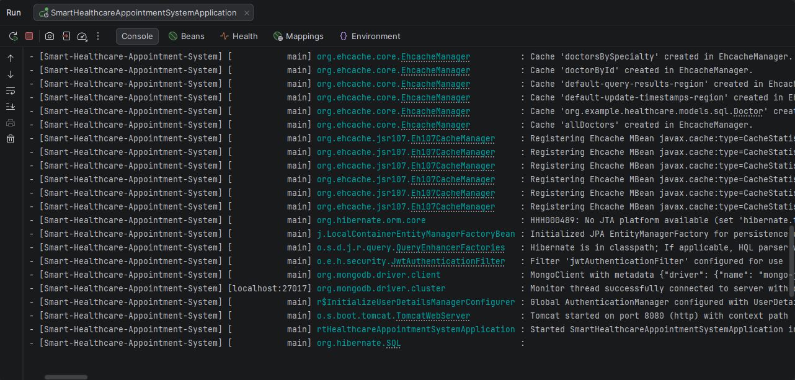

### Postman — full collection run
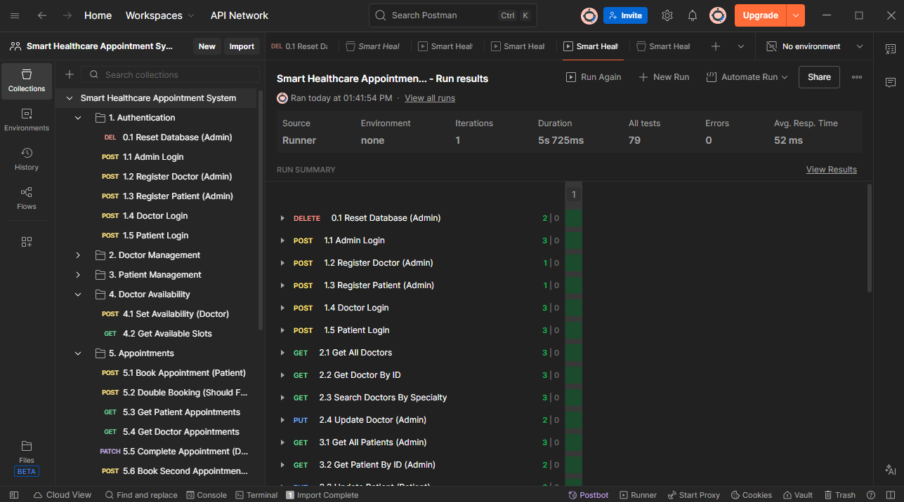

### Booking an appointment
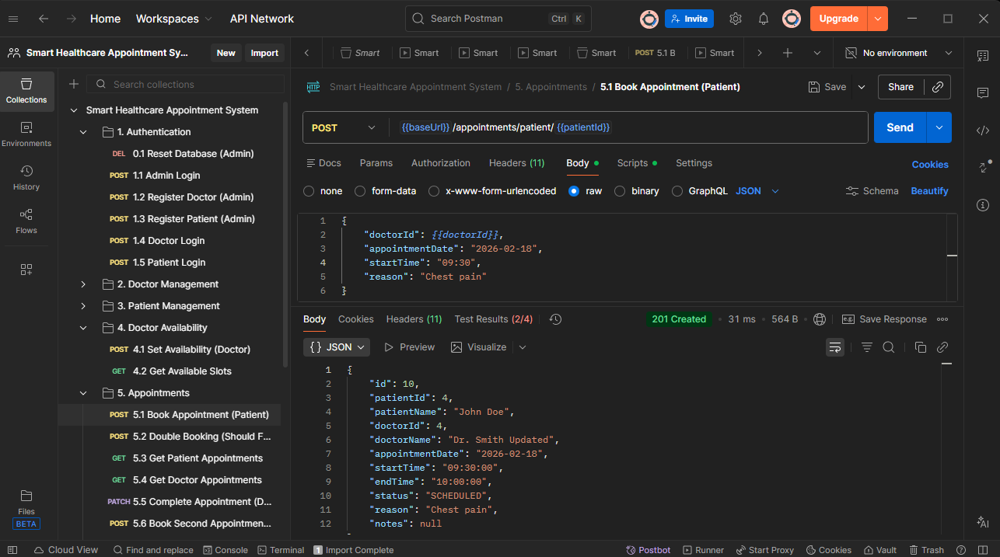

### Double booking rejected
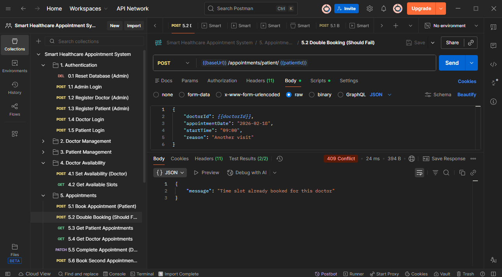

### Security — 401 and 403
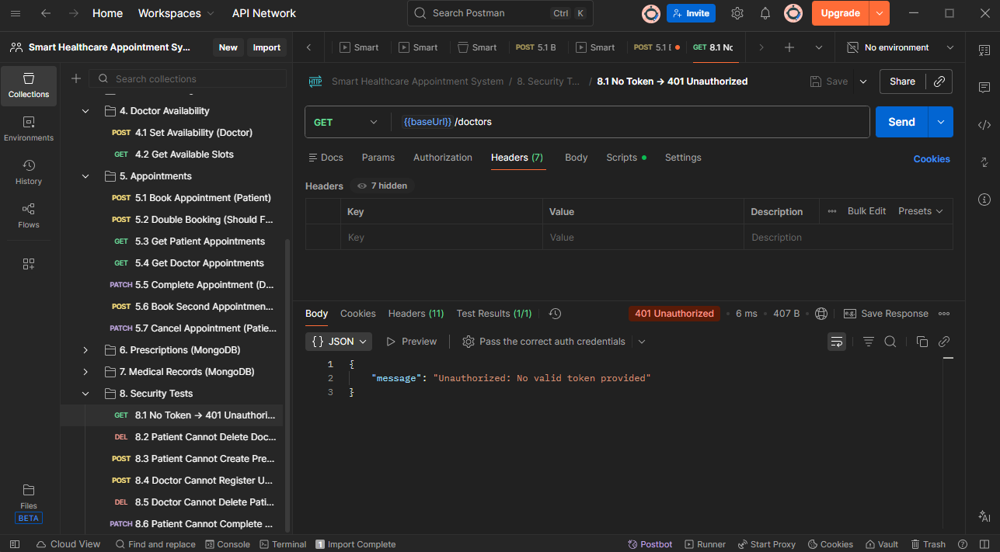
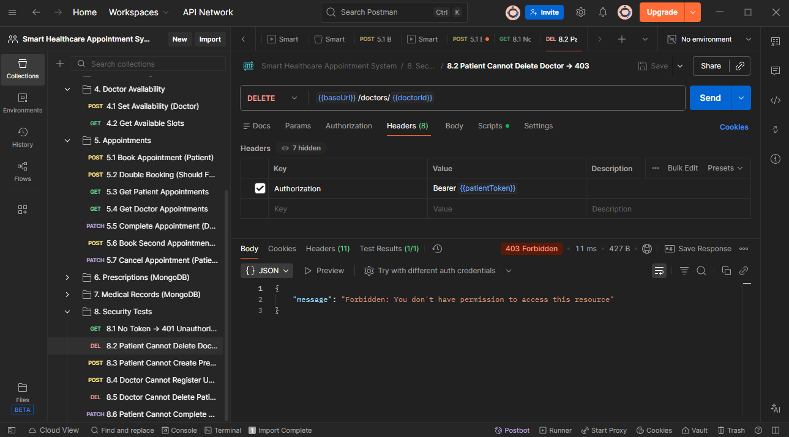

### Unit tests passing
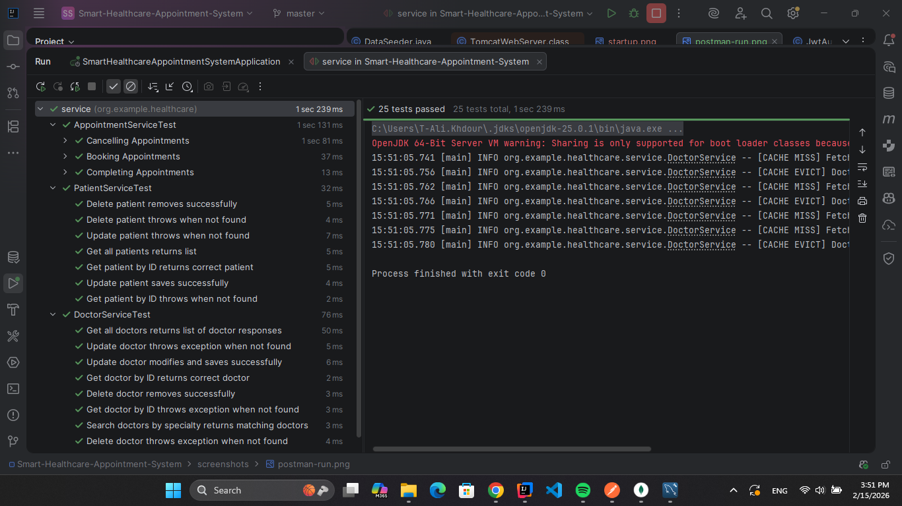

### MySQL tables
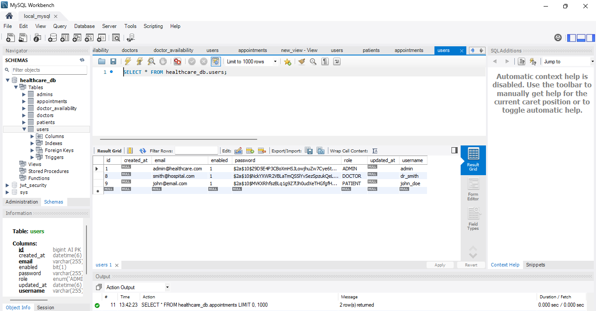

### MongoDB collections
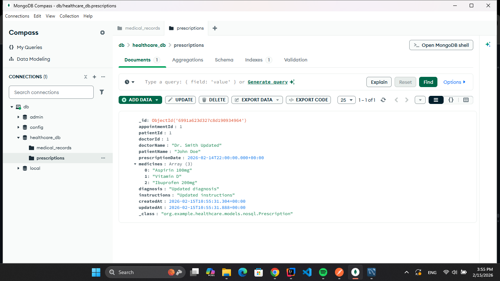

### AOP logging
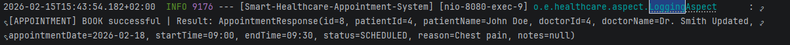

### Cache behaviour
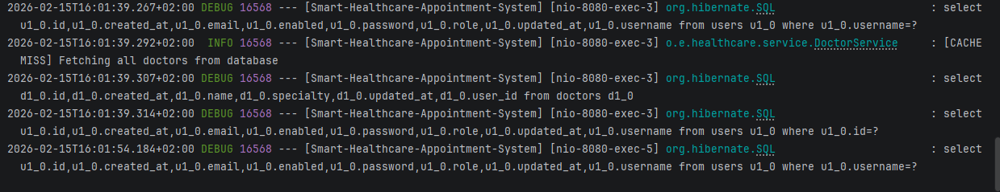

---

<div align="center">

**Built with Spring Boot 4**

Web client: **[smart-healthcare-frontend](https://github.com/khdour17/smart-healthcare-frontend)**

</div>
